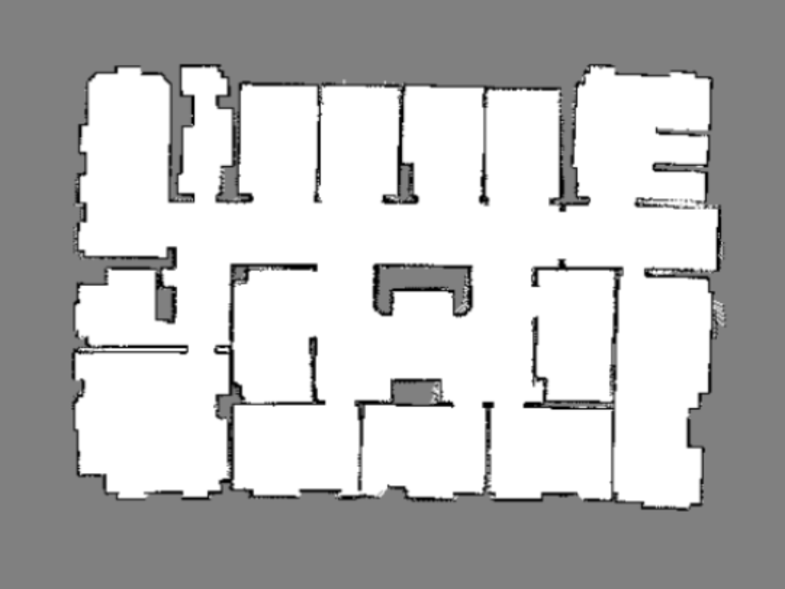
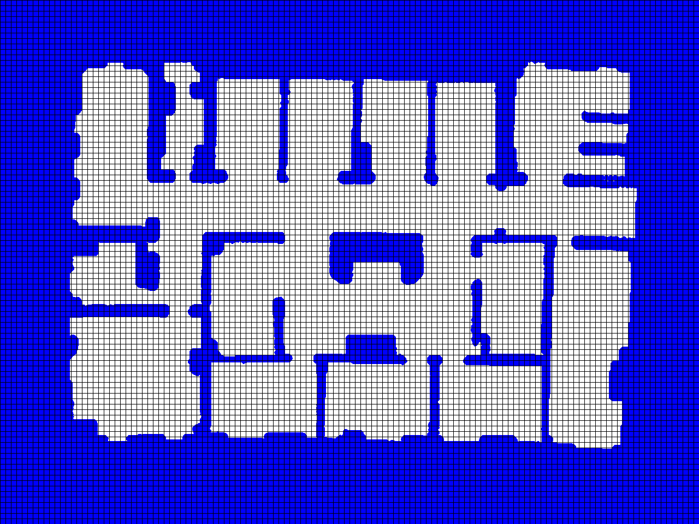
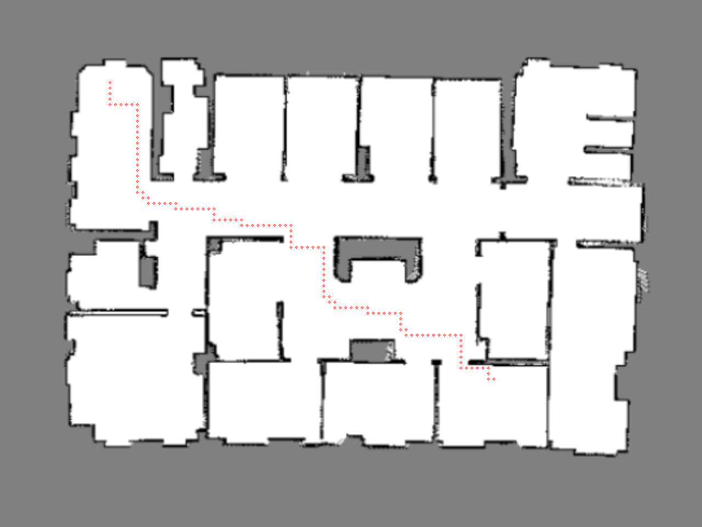

# Path finder

This repository contains:
- A C++ implementation of the A* search algorithm for path planning on occupancy grids. 

## Prerequisites

```
	- Eigen3
	- Boost
	- OpenCV 3.4 
	- YAML C++
```

## Process (example)

### 1. Ground Annotator

Compile

```
	mkdir & cd build
	cmake ..
	make 
```

To test if it works, run the following command:
```
	cd $PATH_FINDING_DIR/build
	./planner
```

Custom planning:
```
	cd $PATH_FINDING_DIR/build
	./planner --heuristic euclidean --search astar --map-path ../maps/map1.png --map-config ../maps/map.yml
```

#### Testing

First, provide input map (default is $PATH_FINDING_DIR/maps/map1.png):
<p align="center">  </p>

Then, the map class creates an obstacle map to use for path finding:
<p align="center"> </p>

Finally, the algorithm computes a trajectory:
<p align="center"> </p>
